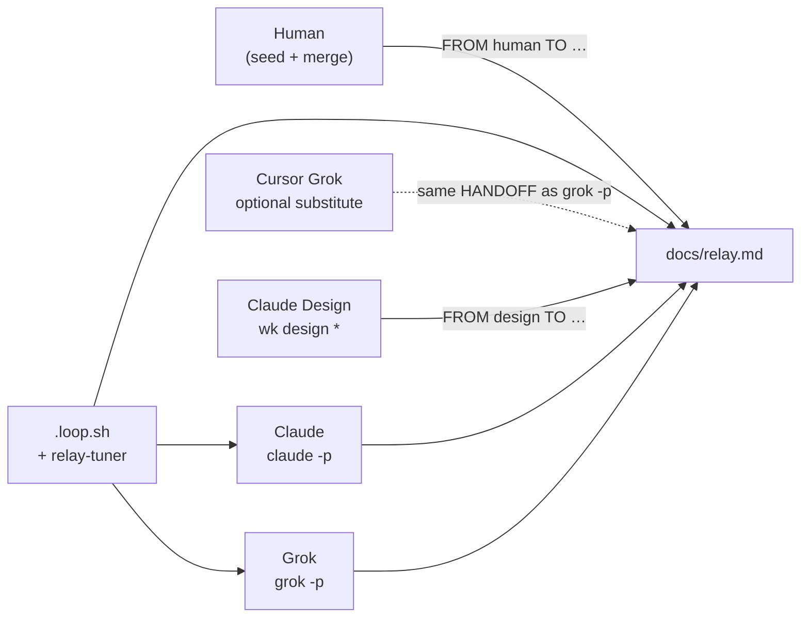

# Autopilot loop — every teammate, their own channel

**Goal:** Claude, Grok, Design, and the loop driver collaborate through **`docs/relay.md` + git** only. The human seeds one task block, starts the driver, and walks away until `HANDOFF: done` or a real `NEEDS:` (merge to `main`, credentials, host actions).

**Mailbox:** `docs/relay.md` at repo root (synced into both worktrees each round).

**Driver:** `.agent-worktrees/.loop.sh` — started by `wk relay <repo>` or `wk relay restart`.

---

## One picture



---

## Shared rules (all code agents)

| Rule | Why |
|------|-----|
| Read the **newest** block where **`TO <you>`** | That block’s `HANDOFF` is your job |
| Append **one** block per turn at the **bottom** | Newest wins for `relay-tuner` |
| Commit only on **`agent/claude`** or **`agent/grok`** | Never `main` from agents |
| **`git add <explicit paths>`** only | Never `git add -A` / `git add .` |
| End the **run** with a **lone** line: `HANDOFF: done` | Prose like `done (re-confirmed…)` does **not** stop the loop |
| `NEEDS: none` | Agent work continues |
| `NEEDS: human …` | Stop; human does that one thing, then appends `FROM human TO …` |

**Verify done before you rely on exit:**

```bash
python3 ~/bin/relay-tuner.py done ~/Documents/GitHub/WON-KNOBBER/docs/relay.md
# must print: True
```

---

## 1. Loop driver (orchestrator — not an “agent”)

**What it is:** Bash script `.agent-worktrees/.loop.sh` + `relay-tuner.py`. No creativity — schedules turns from the mailbox.

| Action | Command |
|--------|---------|
| Start / resume | `wk relay ~/Documents/GitHub/WON-KNOBBER` or `wk relay restart` |
| Watch | `tail -f …/.agent-worktrees/loop.log` or tmux **MONITOR** pane |
| Stop immediately | `HANDOFF: done` in newest block (strict line above) |
| Stop process | `ps aux \| awk '/WON-KNOBBER\/.agent-worktrees\/.loop.sh/'` → `kill <pid>` |

**Each round (up to 15):**

1. `sync_mailbox` — copy root `docs/relay.md` → both worktrees  
2. `relay-tuner plan` — who runs, max-turns (Claude heavy, Grok light)  
3. If `done` → print `✅ done` and **exit**  
4. Maybe **Claude** in `.agent-worktrees/claude` (`claude -p`, merge `agent/grok` first on round > 1)  
5. Maybe **Grok** in `.agent-worktrees/grok` (`grok -p`, merge `agent/claude` first)  
6. Sync relay back to root; `check_done` again  

**Autopilot without human:** Human does **not** type in **RELAY LOOP** tmux. Only `docs/relay.md`.

**Failure modes:**

| Symptom | Fix |
|---------|-----|
| `Session ID … already in use` | Kill duplicate `.loop.sh`; one Claude `-p` at a time |
| Loop runs 15 rounds after “done” | Last `HANDOFF` line must be exactly `HANDOFF: done` |
| Agents edit wrong tree | Only `.agent-worktrees/{claude,grok}` count until merged |

---

## 2. Claude — headless autopilot (`claude -p`)

**Where:** `~/Documents/GitHub/WON-KNOBBER/.agent-worktrees/claude` on branch **`agent/claude`**.

**How you are invoked:** Loop runs:

```bash
claude -p "<relay prompt>" --permission-mode acceptEdits --max-turns <N> \
  --append-system-prompt-file ~/agent-relay-prompt.txt \
  --append-system-prompt-file ~/agent-relay-prompt-claude.txt
```

**Your turn:**

1. `git pull` / merge other branch if loop already merged  
2. Read `docs/relay.md` — newest **`TO claude`**  
3. Execute `HANDOFF` in **your lane** (processor, DSP, presets, CMake, tests)  
4. `git add` explicit paths → commit  
5. Append `FROM claude TO grok` (or `TO claude` if self-continue)  
6. `git add docs/relay.md` → commit  

**Autonomous behavior:** Do not ask the human to paste relay text. Do not wait for tmux input. If blocked on `main` merge or secrets → `NEEDS:` and stop.

**Heavy lane:** Large investigations, builds, preset/backend, detailed HANDOFF checklists **for Grok**.

---

## 3. Grok — headless autopilot (`grok -p`)

**Where:** `~/Documents/GitHub/WON-KNOBBER/.agent-worktrees/grok` on branch **`agent/grok`**.

**How you are invoked:** Loop runs `grok -p` with `~/agent-relay-prompt.txt` + `~/agent-relay-prompt-grok.txt`.

**Your turn:** Same START/END as Claude, but:

- **Lane:** `Source/gui/*`, `Resources/` art, `docs/` — not `PluginProcessor.*` unless HANDOFF says so  
- **Economy:** Smallest diff; prefer `wk test render` over full Ableton unless asked  
- **HANDOFF back:** One concrete UI task for Claude, or `HANDOFF: done`  

**When tuner skips you:** `last_to == claude` and HANDOFF is processor-heavy — correct; do not burn turns.

---

## 4. Grok — Cursor / IDE autopilot (substitute for `grok -p`)

**Same protocol, different process.** This chat is **not** wired to `.loop.sh`, but obeys the **same mailbox**.

**Autopilot mode:**

1. Human says “autopilot” or starts loop with a fresh `FROM human TO grok`  
2. You `git pull` in **grok worktree**, read **`TO grok`**, implement, commit, append block  
3. If **`TO claude`** in newest block → tell human loop will run Claude, or run `wk relay restart`  
4. Stop when **`HANDOFF: done`** and `relay-tuner.py done` → `True`  

**Coordinate with headless Grok:** Never fight the loop — if `.loop.sh` is running, avoid editing the same files simultaneously. Prefer: loop off, Cursor Grok does one turn, commit relay, loop on.

---

## 5. Claude — Cursor / Claude Code (substitute for `claude -p`)

**Where:** Open folder **`.agent-worktrees/claude`** (not `main`).

**Autopilot mode:** Identical to §2, manually each turn:

- Read relay → implement → commit → append relay → commit relay  
- Or: pause loop (`kill` `.loop.sh`), do one turn in IDE, `wk relay restart`  

**Do not** broadcast from IDE chat to Grok — only **committed** `docs/relay.md` counts.

---

## 6. Claude Design — browser autopilot (separate loop)

**Not in tmux `wkteam` panes.** Enters the team only via relay blocks:

```text
### … FROM design TO grok|claude
```

| Mode | Workflow |
|------|----------|
| **Semi-auto** | `wk design login` (once) → edit `docs/design-inbox/HANDOFF.md` → `wk design auto --push` |
| **Manual** | `wk design open` → export assets → commit → `wk design push` |
| **Cron / script** | `wk design auto --push` after something fills `HANDOFF.md` (e.g. human or agent NEEDS) |

**Autonomous handoff to code agents:**

1. Design fills `PROMPT:` / `TO:` / `HANDOFF:` in inbox  
2. `wk design push` appends **`FROM design TO grok`** (or `claude`)  
3. `wk relay restart` — Claude/Grok implement; **`wk test render`** for pixel-check  
4. Code agent appends feedback in relay (not browser paste)  

Design never merges to `main`; never runs `claude -p` in the code worktrees.

---

## 7. Human — minimal orchestrator

You are **not** in the turn rotation. You only:

| When | Action |
|------|--------|
| **Start a run** | Append one block: `FROM human TO claude` (or `grok`) with a concrete `HANDOFF` |
| **Start driver** | `wk day` then `wk relay restart` (or `wk agent .`) |
| **Watch** | tmux MONITOR or `tail -f loop.log` — do **not** type in RELAY LOOP |
| **Unblock** | When an agent writes `NEEDS: human …`, do that one thing, append `FROM human TO …` |
| **Ship** | Merge `agent/grok` / `agent/claude` → `main` (agents must not) |
| **Stop** | `Ctrl+C` loop or let agents write `HANDOFF: done` |

**Zero human mid-run:** Seed task → `wk relay restart` → agents alternate until `done` or a real NEEDS.

---

## 8. `relay-tuner` — who runs next

Reads **last** `### … FROM x TO y` block in `docs/relay.md`.

| Signal | Effect |
|--------|--------|
| `HANDOFF: done` (lone line at end of HANDOFF field) | `stop`, no Claude/Grok |
| `TO grok` + GUI-ish HANDOFF | `run_grok: true`, Grok max-turns low |
| `TO claude` + heavy HANDOFF | `run_claude: true`, Claude max-turns high |
| `NEEDS:` not starting with `none` | Pause for human |
| Late rounds / noop Grok | Taper Grok, Claude-only |

State file: `.agent-worktrees/relay-state.json` (MONITOR pane).

---

## 9. Fully autonomous startup checklist

```bash
# 1) Day setup (worktrees, health)
wk day ~/Documents/GitHub/WON-KNOBBER

# 2) Seed mailbox (example)
cat >> ~/Documents/GitHub/WON-KNOBBER/docs/relay.md <<'EOF'

### 2026-06-04 12:00 FROM human TO claude
DID: New task seeded for autonomous run.
HANDOFF: <one concrete first step for Claude>
NEEDS: none
EOF

# 3) Commit seed on main OR copy into worktrees and commit on agent/claude
# 4) Start loop
wk relay restart

# 5) Optional: parallel Design → code
wk design auto --push   # after HANDOFF.md ready
```

**End state:** Newest block has `HANDOFF: done` and `python3 ~/bin/relay-tuner.py done …` → `True`.

---

## 10. QA autopilot (after GUI HANDOFF)

Order (agents run without human):

1. `wk test render`  
2. `wk test auval`  
3. `wk pin flip` then `wk drive flip bypass`  
4. `wk test gui` only if HANDOFF requires Ableton e2e  

Never `activate Live` during drive. See `wk playbook`.

---

## Quick reference

| Teammate | Autopilot channel | Worktree / branch |
|----------|-------------------|-------------------|
| Loop driver | `.loop.sh` | N/A |
| Claude headless | `claude -p` | `.agent-worktrees/claude` → `agent/claude` |
| Grok headless | `grok -p` | `.agent-worktrees/grok` → `agent/grok` |
| Claude IDE | Cursor / CC | same as claude worktree |
| Grok IDE | Cursor Grok | same as grok worktree |
| Claude Design | `wk design auto/push` | browser + `docs/design-inbox/` |
| Human | `FROM human TO …` + merge | `main` |

**Prompts loaded every relay turn:** `~/agent-relay-prompt.txt`, `~/agent-relay-prompt-claude.txt`, `~/agent-relay-prompt-grok.txt`.

**More:** `AGENTS.md` (lanes), `docs/AGENT_TOOLKIT.md` (wk commands), `docs/design-inbox/README.md` (Design).